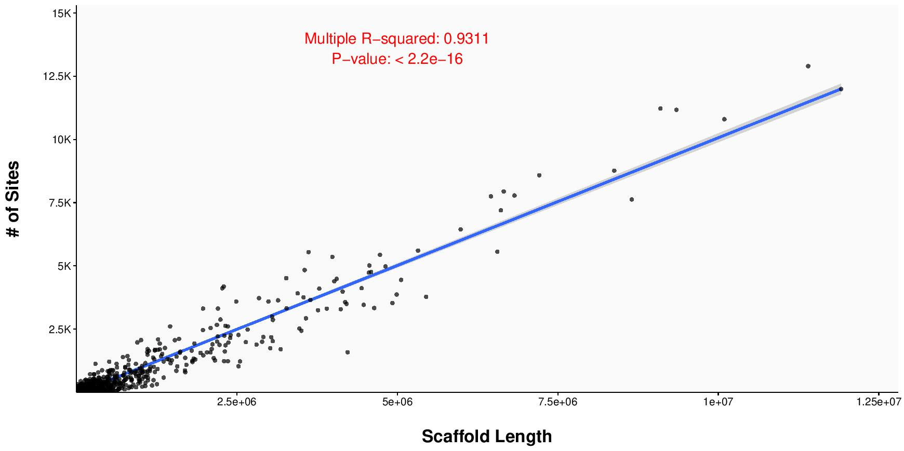

# **Genetic analysis with SNPs from msGBS library**

Killfish Project Pipeline | Ultra Documentation - by George Pacheco [](https://orcid.org/0000-0002-9367-6813)  and Waldir M. Berbel-Filho [](https://orcid.org/0000-0001-6991-4685)


This documentation outlines the pipelines used for genetic analysis (SNPs genotypes and sites extracted from msGBS library) in Berbel-Filho et al. (XXXX)

Last Modified: 02 July 2020              

Please, contact george.pacheco@snm.ku.dk or waldirmbf@gmail.com should any question arise.
__________________________________________
The original methylation-sensitive genotype-by-sequencing (msGBS) library contained samples from four _Kryptolebias_ species, on which we were interested to investigate the relationships between genetic and epigenetic variation across mating systems. Given the evidence of hybridisation between _K. ocellatus_ and _K. hermaphroditus_, we decided to subset the samples containing only _K. ocellatus_ and _K. hermaphroditus_ populations. We set up a threshold of only samples with at least 500.000 reads to be included in this dataset. The number of total number of  reads per sample in the library was retrieved from the demultiplexing results in [gbsDemultiplex.stats.txt](gbsDemultiplex.stats.txt).

__________________________________________

### 1) Filtering samples according to threshold of reads

A [file containing a list of samples](KFP--GoodSamplesReads.list.txt)  with number of reads above the threshold (>500k reads) was created was created as follows:

```
tail -n +2 ~/Desktop/msGBS_data/George/GBS_Data/KFP-Demultiplexed_GBSX--v1.3/gbsDemultiplex.stats | awk '$4>500000' | cut -f1 > ~/Desktop/msGBS_data/George/KFP-Mapped/KFP--GoodSamplesReads.list
```

### 2)  Further filtering samples according to species and populations of interest

To make a list of BAM files containing only populations of _K. ocellatus_ and _K. hermaphroditus_, we further filtered the data removing samples from freshwater _Kryptolebias_ species (_K. brasiliensis and K. gracilis_) and another _Kryptolebias_ population from Espírito-Santo in Brazil (ES). As follows:

```
find ~/Desktop/msGBS_data/George/KFP-Mapped/SortedIndexed/*.bam | grep -f ~/Desktop/msGBS_data/George/KFP-Mapped/KFP--GoodSamplesReads.list | grep -f ~/Desktop/msGBS_data/George/KFP-Mapped/KFP--GoodSamplesReadsNoKbraKgra.list | fgrep -v -f ~/Desktop/msGBS_data/George/KFP-Mapped/KFP--GoodSamples_OnlyES1_Kher.list > ~/Desktop/msGBS_data/George/KFP-Mapped/KFP--GoodSamplesReads_NoES1_Kher.BAMlist
```
The FastQC files inclued in this project can be acessed at
[NCBI acession PRJNA563625](https://www.ncbi.nlm.nih.gov/bioproject/PRJNA563625).

### 3)  Number of sites covered in the dataset (Dataset  I)
The software **ANGSD v. 0.92** was used to calculate the total number of reads in the dataset under the following parameters.

```
~/Desktop/msGBS_data/Tools/ngsTools/angsd/angsd -nThreads 2 -ref ~/Desktop/msGBS_data/George/Genome/GCF_001649575.1_ASM164957v1_genomic.Edited.fasta -bam ~/Desktop/msGBS_data/George/KFP-Mapped/KFP--GoodSamplesReads_NoES1_Kher.BAMlist -remove_bads 1 -uniqueOnly 1 -baq 1 -C 50 -minMapQ 30 -minQ 20 -minInd $((53*95/100)) -doCounts 1 -GL 1 -doGlf 2 -doMajorMinor 1 -doMaf 1 -doPost 2 -doGeno 3 -doPlink 2 -geno_minDepth 3 -setMaxDepth $((53*500)) -dumpCounts 2 -postCutoff 0.95 -doHaploCall 1 -doVcf 1 -out ~/Desktop/msGBS_data/George/KFP-ANGSDRuns/KFP--GoodSamplesReads_NoES1_Kher_SITES--Article--Ultra
```
`-remove_bads 1` = Discard 'bad' reads, (flag>=256).

`-uniqueOnly 1` = Discard reads that doesn't map uniquely.

`-baq 1`= Adjust qscores around indels (1=normal baq 2= extended(as SAMtools)).

`-C 50` = Adjust mapQ for excessive mismatches (as SAMtools).

`-minMapQ 30` = Discard reads with mapping quality below 30.

`-minQ 20` = Discard bases with base quality below 20.

`-minInd $((53*95/100))` = Only use site if at least 95%  of all 53 individuals has data.

`-doCounts 1` = Count the number A,C,G,T. All sites, All samples.

`-GL 1` = Genotype-likelihood using SAMtools models.

`-doGlf 2`= Output the log genotype likelihoods to a file as beagle genotype likelihood format (use directly for imputation).

`-doMajorMinor 1` = Infer major and minor allele from GL.

`-doMaf 1` = Known major, and Known minor.

`-doPost 2` = Calculate posterior probabiblity based on uniform distribution.

`-doGeno 3` = Write the called genotype directly (eg. AA,AC).

`-doPlink 2` = Create Plink file in a tfam/tped format.

`-geno_minDepth 3` = Minimum depth of 3 reads per site across all individuals.

`-setMaxDepth $((53*500))` = Maximum depth to include site is 500.

`-dumpCounts 2` = Print the depth for each site for each individual.

`-postCutoff 0.95` = Only genotype to missing if below this threshold (5%).

`-doHaploCall 1` = When haploid calling, use a random base.

`-doVcf 1` =  Create VCF file.


The total number of sites in the dataset was __597.333__.


#### 3.1)  Real coverage calculation per sample in Dataset I
The following script was used to calculate the average depth of reads across all sites per individual in the dataset I.

```
zcat ~/Desktop/msGBS_data/George/KFP-ANGSDRuns/KFP--GoodSamplesReads_NoES1_Kher_SITES--Article--Ultra.counts.gz | tail -n +2 | gawk ' {for (i=1;i<=NF;i++){a[i]+=$i;++count[i]}} END{ for(i=1;i<=NF;i++){print a[i]/count[i]}}' | paste ~/Desktop/msGBS_data/George/KFP-Mapped/KFP--GoodSamplesReads_NoES1_Kher.labels - > ~/Desktop/msGBS_data/George/KFP-Analyses/KFP-Miscellaneous/KFP-RealCoverage/KFP--GoodSamplesReads_NoES1_Kher_SITES--Article--Ultra.GL-RealCoverage.txt
```
The results can be found in this [file](KFP--GoodSamplesReads_NoES1_Kher_SITES--Article--Ultra.GL-RealCoverage.txt).

#### 3.2)  Average percentage of missing data per sample in Dataset I
The following script was used to the average percentage of missing data across all sites per individual in the dataset I.

```
zcat ~/Desktop/msGBS_data/George/KFP-ANGSDRuns/KFP--GoodSamplesReads_NoES1_Kher_SITES--Article--Ultra.beagle.gz | tail -n +2 | perl ~/Desktop/msGBS_data/Tools/Scripts/call_geno.pl --skip 3 | cut -f 4- | awk '{ for(i=1;i<=NF; i++){ if($i==-1)x[i]++} } END{ for(i=1;i<=NF; i++) print i"\t"x[i] }' | paste ~/Desktop/msGBS_data/George/KFP-Mapped/KFP--GoodSamplesReads_NoES1_Kher.labels - | awk '{print $1"\t"$3"\t"$3*100/597733}' > ~/Desktop/msGBS_data/George/KFP-Analyses/KFP-Miscellaneous/KFP-MissingData/KFP--GoodSamplesReads_NoES1_Kher_SITES--Article--Ultra.GL-MissingData.txt
```

The results can be found in this [file](KFP--GoodSamplesReads_NoES1_Kher_SITES--Article--Ultra.GL-MissingData.txt).

### 4) Calling SNPs (Dataset  II)
The software **ANGSD v. 0.92** was used to call SNPs genotypes calculate the  in the dataset under the following parameters.

```
~/Desktop/msGBS_data/Tools/ngsTools/angsd/angsd -nThreads 2 -ref ~/Desktop/msGBS_data/George/Genome/GCF_001649575.1_ASM164957v1_genomic.Edited.fasta -bam ~/Desktop/msGBS_data/George/KFP-Mapped/KFP--GoodSamplesReads_NoES1_Kher.BAMlist -remove_bads 1 -uniqueOnly 1 -baq 1 -C 50 -minMapQ 30 -minQ 20 -minInd $((53*95/100)) -doCounts 1 -GL 1 -doGlf 2 -doMajorMinor 1 -doMaf 1 -MinMaf 0.02 -SNP_pval 1e-6 -doPost 2 -doGeno 3 -doPlink 2 -geno_minDepth 3 -setMaxDepth $((53*500)) -dumpCounts 2 -postCutoff 0.95 -doHaploCall 1 -doVcf 1 -out ~/Desktop/msGBS_data/George/KFP-ANGSDRuns/KFP--GoodSamplesReads_NoES1_Kher--Article--Ultra
```
`-remove_bads 1` = Discard 'bad' reads, (flag>=256).

`-uniqueOnly 1` = Discard reads that doesn't map uniquely.

`-baq 1`= Adjust qscores around indels (1=normal baq 2= extended(as SAMtools)).

`-C 50` = Adjust mapQ for excessive mismatches (as SAMtools)

`-minMapQ 30` = Discard reads with mapping quality below 30.

`-minQ 20` = Discard bases with base quality below 20.

`-minInd $((53*95/100))` = Only use site if at least 95% of all 53 individuals has data.

`-doCounts 1` = Count the number A,C,G,T. All sites, All samples.

`-GL 1` = Genotype-likelihood using SAMtools models.

`-doGlf 2`= Output the log genotype likelihoods to a file as beagle genotype likelihood format (use directly for imputation).

`-doMajorMinor 1` = Infer major and minor allele from GL.

`-doMaf 1` = Known major, and Known minor.

`-MinMaf 0.02`= Only work with sites with Maf above 0.02.

`-SNP_pval 1e-6` = Only work with sites with a p-value less than 1e-6.

`-doPost 2` = Calculate posterior probabiblity based on uniform distribution.

`-doGeno 3` = Write the called genotype directly (eg. AA,AC).

`-doPlink 2` = Create Plink file in a tfam/tped format.

`-geno_minDepth 3` = Minimum depth of 3 reads per site across all individuals.

`-setMaxDepth $((53*500))` = Maximum depth to include site is 500.

`-dumpCounts 2` = Print the depth for each site for each individual.

`-postCutoff 0.95` = Only genotype to missing if below this threshold (5%).

`-doHaploCall 1` = When haploid calling, use a random base.

`-doVcf 1` =  Create VCF file.

The total number of SNPs in the dataset was __5.477__.


#### 4.1)  Real coverage calculation per sample in Dataset II
The following script was used to calculate the average depth of reads across all sites per individual in the dataset II.
```
zcat ~/Desktop/msGBS_data/George/KFP-ANGSDRuns/KFP--GoodSamplesReads_NoES1_Kher--Article--Ultra.counts.gz | tail -n +2 | gawk ' {for (i=1;i<=NF;i++){a[i]+=$i;++count[i]}} END{ for(i=1;i<=NF;i++){print a[i]/count[i]}}' | paste ~/Desktop/msGBS_data/George/KFP-Mapped/KFP--GoodSamplesReads_NoES1_Kher.labels - > ~/Desktop/msGBS_data/George/KFP-Analyses/KFP-Miscellaneous/KFP-RealCoverage/KFP--GoodSamplesReads_NoES1_Kher--Article--Ultra.GL-RealCoverage.txt
```

The results can be found in this [file](KFP-RealCoverageKFP--GoodSamplesReads_NoES1_Kher--Article--Ultra.GL-RealCoverage.txt).

#### 4.2)  Average percentage of missing data per sample in Dataset II
The following script was used to the average percentage of missing data across all sites per individual in the dataset II.
```
zcat ~/Desktop/msGBS_data/George/KFP-ANGSDRuns/KFP--GoodSamplesReads_NoES1_Kher--Article--Ultra.beagle.gz | tail -n +2 | perl ~/Desktop/msGBS_data/Tools/Scripts/call_geno.pl --skip 3 | cut -f 4- | awk '{ for(i=1;i<=NF; i++){ if($i==-1)x[i]++} } END{ for(i=1;i<=NF; i++) print i"\t"x[i] }' | paste ~/Desktop/msGBS_data/George/KFP-Mapped/KFP--GoodSamplesReads_NoES1_Kher.labels - | awk '{print $1"\t"$3"\t"$3*100/5477}' > ~/Desktop/msGBS_data/George/KFP-Analyses/KFP-Miscellaneous/KFP-MissingData/KFP--GoodSamplesReads_NoES1_Kher--Article--Ultra.GL-MissingData.txt
```

The results can be found in this [file](KFP--GoodSamplesReads_NoES1_Kher--Article--Ultra.GL-MissingData.txt.txt).

### 5) Genomic analysis with Dataset I (597.333 sites)
#### 5.1) Sites distribution
To have an ideia of the sites density across the reference genome in our dataset, the number of scaffolds with at least one site was reriteved as follows:
```
zcat ~/Desktop/msGBS_data/George/KFP-ANGSDRuns/KFP--GoodSamplesReads_NoES1_Kher_SITES--Article--Ultra.mafs.gz | tail -n +2 | sort -u -k 1,1 | wc -l
```
 __929 (30.24% of the total)__ scaffolds with had at least one site.

For sites density per scaffold, we used the following scripts:

```
zcat ~/Desktop/msGBS_data/George/KFP-ANGSDRuns/KFP--GoodSamplesReads_NoES1_Kher_SITES--Article--Ultra.mafs.gz | tail -n +2 | cut -f1 | sort | uniq -c | awk '{print $2"\t"$1}' | sort -n -k 2,2 > ~/Desktop/msGBS_data/George/KFP-ANGSDRuns/KFP--GoodSamplesReads_NoES1_Kher_SITES--Article--Ultra.SITESDensity.txt
```
Number of sites per scaffold which had at least one site is contained in this [file](KFP--GoodSamplesReads_NoES1_Kher_SITES--Article--Ultra.SITESDensity.txt). Now, we extracted scaffold lenght and number of sites per scaffold as:
```
awk 'BEGIN{OFS="\t"} NR==FNR{x[$1]=$2} NR!=FNR && $2>1000{if(!x[$1])x[$1]=0; print $1,$2,x[$1]}' ~/Desktop/msGBS_data/George/KFP-ANGSDRuns/KFP--GoodSamplesReads_NoES1_Kher_SITES--Article--Ultra.SITESDensity.txt ~/Desktop/msGBS_data/George/Genome/GCF_001649575.1_ASM164957v1_genomic.Edited.fasta.fai | sort -n -k 2,2 > ~/Desktop/msGBS_data/George/KFP-ANGSDRuns/KFP--GoodSamplesReads_NoES1_Kher_SITES--Article--Ultra.ScaffoldInfo.txt
```
 Scaffold lenght and number of sites per scaffold is contained in this [file](KFP--GoodSamplesReads_NoES1_Kher_SITES--Article--Ultra.ScaffoldInfo.txt). We generated a file containing lenght information only for the scaffolds containting at least one site. As follows:
```
awk '{if ($3!=0) print;}' ~/Desktop/msGBS_data/George/KFP-ANGSDRuns/KFP--GoodSamplesReads_NoES1_Kher_SITES--Article--Ultra.ScaffoldInfo.txt > ~/Desktop/msGBS_data/George/KFP-ANGSDRuns/KFP--GoodSamplesReads_NoES1_Kher_SITES--Article--Ultra.ScaffoldInfo_OnlyWithSites.txt
```
Finally to correlate sites density and scaffold lenght, we used this [**R script**](KFP--ToPlot_ScaffoldLength-NumberOfSites.R), and following is the plot:



#### 5.2) Proportion of heterozygous sites
To calculate the proportion of heterozygous sites in dataset I, we  first needed to filter the sites (though a '.bed' file) selected according to the parameters used in the **step 3**  based on the '.mafs' file from this run. As follows:
```
zcat ~/Desktop/msGBS_data/George/KFP-ANGSDRuns/KFP--GoodSamplesReads_NoES1_Kher_SITES--Article--Ultra.mafs.gz | cut -f1,2 | tail -n +2 | awk '{print $1"\t"$2-1"\t"$2}' | bedtools merge -i - > ~/Desktop/msGBS_data/George/KFP-Analyses/KFP-Heterozygosity/KFP--GoodSamplesReads_NoES1_Kher_SITES--Article--Ultra.bed
```
The '.bed' file created is available [here](KFP--GoodSamplesReads_NoES1_Kher_SITES--Article--Ultra.bed). This '.bed' needs to be indexed. We used **ANGSD v. 0.92** as follows:
```
awk '{print $1"\t"($2+1)"\t"$3}' ~/Desktop/msGBS_data/George/KFP-Analyses/KFP-Heterozygosity/KFP--GoodSamplesReads_NoES1_Kher_SITES--Article--Ultra.bed > ~/Desktop/msGBS_data/George/KFP-Analyses/KFP-Heterozygosity/KFP--GoodSamplesReads_NoES1_Kher_SITES--Article--Ultra.pos
~/Desktop/msGBS_data/Tools/ngsTools/angsd/angsd sites index ~/Desktop/msGBS_data/George/KFP-Analyses/KFP-Heterozygosity/KFP--GoodSamplesReads_NoES1_Kher_SITES--Article--Ultra.pos
```
To calculate the proportion of heterozygous sites, **ANGSD v. 0.92** requires a
'ancestral' file, a  fasta file from a outgroup individual. We used a '.bam' file
from a _K.brasiliensis_, a freshwater _Kryptolebias_ species from Southeast Brazil. We generated the ancestral sequence as follows:
```
~/Desktop/msGBS_data/Tools/ngsTools/angsd/angsd -nThreads 2 -i ~/Desktop/msGBS_data/George/KFP-Mapped/SortedIndexed/RJ3_05_Kbra.bam -ref ~/Desktop/msGBS_data/George/Genome/GCF_001649575.1_ASM164957v1_genomic.Edited.fasta -doFasta 1 -doCounts 1 -explode 1 -rmTrans 0 -seed 543 -remove_bads 1 -uniqueOnly 1 -baq 1 -C 50 -minMapQ 30 -minQ 20 -out ~/Desktop/msGBS_data/George/KFP-ANGSDRuns/RJ3_05_Kbra--Ancestral
```
`-nThreads 2` = Two threads to be used while running.

`-i` =  Path to input bam file.

`-ref`= Path to reference genome.

`-doFasta 1` = Sample a random base at each position. N's or filtered based are ignored.

`-doCounts 1` = Determine the most common base.

`-explode 1` = Only output chromossomes with data.

`-rmTrans 0` = Remove transitions.

`-seed 543` = Random seed number.

`-remove_bads 1` = Discard 'bad' reads, (flag>=256).

`-uniqueOnly 1` = Discard reads that doesn't map uniquely.

`-baq 1`= Adjust qscores around indels (1=normal baq 2= extended(as SAMtools)).

`-C 50` = Adjust mapQ for excessive mismatches (as SAMtools).

`-minMapQ 30` = Discard reads with mapping quality below 30.

`-minQ 20` = Discard bases with base quality below 20.

To index the 'ancestral sequence', we used **samtools** as follows:
```
samtools faidx ~/Desktop/msGBS_data/George/KFP-ANGSDRuns/RJ3_05_Kbra--Ancestral.fa
```

To generate the heterozygosity file for each individual, we used **ANGSD v. 0.92** as follows:
```
parallel --plus ~/Desktop/msGBS_data/Tools/ngsTools/angsd/angsd -i {} -anc ~/Desktop/msGBS_data/George/KFP-ANGSDRuns/RJ3_05_Kbra--Ancestral.fa -ref ~/Desktop/msGBS_data/George/Genome/GCF_001649575.1_ASM164957v1_genomic.Edited.fasta -sites ~/Desktop/msGBS_data/George/KFP-Analyses/KFP-Heterozygosity/KFP--GoodSamplesReads_NoES1_Kher_SITES--Article--Ultra.pos -GL 1 -doSaf 1 -fold 1 -remove_bads 1 -uniqueOnly 1 -baq 1 -C 50 -minMapQ 30 -minQ 20 -out ~/Desktop/msGBS_data/George/KFP-Analyses/KFP-Heterozygosity/NoES1_Kher/{/...} :::: ~/Desktop/msGBS_data/George/KFP-Mapped/KFP--GoodSamplesReads_NoES1_Kher.BAMlist
```
`-anc` = fasta file containting outgroup individual. We selected one file from _K. brasiliensis_.

`-ref` = Rerence genome file.

`-sites` = File containing the sites to include in analysis.

`-GL 1` = Genotype-likelihood using SAMtools models.

`-doSaf 1` = Calculate the Site allele frequency likelihood based on individual genotype likelihoods assuming HWE.

`-fold 1` = Estimate folded SFS.

`-remove_bads 1` = Discard 'bad' reads, (flag>=256).

`-uniqueOnly 1` = Discard reads that doesn't map uniquely.

`-baq 1`= Adjust qscores around indels (1=normal baq 2= extended(as SAMtools)).

`-C 50` = Adjust mapQ for excessive mismatches (as SAMtools).

`-minMapQ 30` = Discard reads with mapping quality below 30.

`-minQ 20` = Discard bases with base quality below 20.

To generate the fractions of heterozygosity file, we used **ANGSD v. 0.92** as follows:

```
parallel --plus "~/Desktop/msGBS_data/Tools/ngsTools/angsd/misc/realSFS {} > ~/Desktop/msGBS_data/George/KFP-Analyses/KFP-Heterozygosity/NoES1_Kher/{/..}.het" ::: ~/Desktop/msGBS_data/George/KFP-Analyses/KFP-Heterozygosity/NoES1_Kher/*.saf.idx
```

Finally, to calculate the percentage of heterozygous sites across individuals, we used:
```
fgrep '.' *.het | tr ":" " " | awk '{print $1"\t"$3/($2+$3)*100}' | gawk '{print $1"\t"$2"\t"lol[1]}' | sort -k 1,1gr | awk '{split($0,a,"."); print a[1]"\t"$2"\t"$3'} | awk '{split($0,a,"_"); print $1"\t"a[1]"_"a[3]'} > ~/Desktop/msGBS_data/George/KFP-Analyses/KFP-Heterozygosity/NoES1_Kher/KFP--GoodSamplesReads_NoES1_Kher_SITES--Article--Ultra.Heterozygosity.txt
```
The file containing the proportion of heterozygous sites can be found [here](KFP--GoodSamplesReads_NoES1_Kher_SITES--Article--Ultra.Heterozygosity.txt).

### 5) Genomic analysis with Dataset II (5.477 SNPs)

#### 5.1)  Estimate individual ancestry
To estimate the potential number of genetic clusters (K) in the dataset as well as its proportion across individuals in the dataset, we used the software **ngsAdmix**, using the '.beagle' SNPs file generated in **step 3**. As follows:
```
export N_REP=100

for K in `seq -w 2 12`
do
    echo /groups/hologenomics/fgvieira/scripts/wrapper_ngsAdmix.sh -P 12 -likes ~/data/Temporary/KFP/KFP--GoodSamplesReads_NoES1_Kher--Article--Ultra.beagle.gz -K $K -minMaf 0 -tol 1e-6 -tolLike50 1e-3 -maxiter 10000 -o ~/data/Temporary/KFP/KFP--GoodSamplesReads_NoES1_Kher--Article--Ultra.${K}

done | xsbatch -c 12 --mem-per-cpu 1024 --max-array-jobs 12 -J ngsAdmix -R --time 10-00 --
```
`-P 12` = Number of threads equals 12.

`-likes` = Beagle file with genotype likelihoods.

`-K 12` =  Number of ancestral populations to be tested (12 in this case).

 `-minMaf 0` = Minimum minor allele frequency of zero.

 `-tol 1e-6` = Tolerance for convergence of 1e-6.

 `-tolLike50 1e-3` = Loglikelihood difference of 1e-3 in 50 iterations.

 `-maxiter 10000` = Maximum number of 10k EM iterations.

 #### 5.2)  Multidimensional scalling (MDS)
 To have a multidimensional analysis of variation, we first generated a pairwise distance matrix between all individuals in the dataset using **ngsDist** as follows:
```
~/Desktop/msGBS_data/Tools/ngsTools/ngsDist/ngsDist --n_threads 8 --geno ~/Desktop/msGBS_data/George/KFP-ANGSDRuns/KFP--GoodSamplesReads_NoES1_Kher--Article--Ultra.beagle.gz --pairwise_del --seed 55 --probs --n_ind 53 --n_sites 5477 --labels ~/Desktop/msGBS_data/George/KFP-Mapped/KFP--GoodSamplesReads_NoES1_Kher.labels --out ~/Desktop/msGBS_data/George/KFP-Analyses/KFP-MDS/KFP--GoodSamplesReads_NoES1_Kher--Article--Ultra.dist
 ```
`--n_threads 8` = Number of threads equals 8.

`--geno` =  Path to genotype likelihood file.

`--pairwise_del` = Pairwise deletion of missing data.

`--seed 55` = Random number generator seed.

`--probs` = Input is composed of genotype likelihoods.

`--n_ind 53` = Number of individuals in the dataset (53).

`--n_sites 5477` = Number of SNPs in the dataset (5477).

To perfom MDS analysis with genetic distance data, we used the following script:

```
tail -n +3 ~/Desktop/msGBS_data/George/KFP-Analyses/KFP-MDS/KFP--GoodSamplesReads_NoES1_Kher--Article--Ultra.dist | Rscript --vanilla --slave ~/Desktop/msGBS_data/Tools/Scripts/get_PCA.R --no_header --data_symm -n 10 -m "mds" -o ~/Desktop/msGBS_data/George/KFP-Analyses/KFP-MDS/KFP--GoodSamplesReads_NoES1_Kher--Article--Ultra.mds
```

The R script 'get_PCA.R' is available [here](get_PCA.R). The file with the MDS scores for each individuals is available [here](KFP--GoodSamplesReads_NoES1_Kher--Article--Ultra.mds).

### 6) Calling SNPs for a subset of individuals with no missing data (Dataset  III)
Given the evidence of hybridisation was limited to two populations in southeast Brazil (GUA and FUN, RJ04 and RJ05 in the BAM files), we created a different  the dataset to include only individuals from those populations for analysis especifically looking at hybridisation. We called SNPs for this particular set of individuals, but this time not allowing for any missing data. As follows:
```
~/Desktop/msGBS_data/Tools/ngsTools/angsd/angsd -nThreads 2 -ref ~/Desktop/msGBS_data/George/Genome/GCF_001649575.1_ASM164957v1_genomic.Edited.fasta -bam ~/Desktop/msGBS_data/George/KFP-Mapped/KFP--GoodSamplesReads_OnlyKher_NoES1_Kher-Koce.BAMlist -remove_bads 1 -uniqueOnly 1 -baq 1 -C 50 -minMapQ 30 -minQ 20 -minInd $((39*100/100)) -doCounts 1 -GL 1 -doGlf 2 -doMajorMinor 1 -doMaf 1 -MinMaf 0.03 -SNP_pval 1e-6 -doPost 2 -doGeno 3 -doPlink 2 -geno_minDepth 3 -setMaxDepth $((39*500)) -dumpCounts 2 -postCutoff 0.95 -doHaploCall 1 -doVcf 1 -out ~/Desktop/msGBS_data/George/KFP-ANGSDRuns/KFP--GoodSamplesReads_OnlyKher_NoES1_Kher-Koce_NoMissingData--Article--Ultra
```

The parameters are the same as used in **step 4** for SNPs calling in Dataset II. The only exepction this time is that on parameter `-minInd` we set to ((39*100/100)), meaning that to consider a SNP, all the 39 individuals in the dataset must have reads within the criteria used in the script for that position. No missing data for any SNP was allowed this time. The total number of SNPs generated in this dataset was __1,633__.

#### 6.1)  Selecting subset of SNPs from Dataset III for NewHybrids.

To classify the individuals across different hybrid classes (e.g. parental species 1, parental species 2, F1, F2, backcross 1 or backcross 2) we used the software **NewHybrids v.1.1**. However, this software only allows the use of 200 SNPs. We have filtered the SNPs from Dataset III to be the most conservative as possible, with the lowest pairwise LD and highest F<sub>ST</sub> values.

##### 6.1.1)  Pairwise LD between SNPs
We first selected the SNPs with the lowest pariwise linkage disequilibrium values. We used the software **ngsLD**. We first needed to create a '.pos file' as follows:
```
zcat ~/Desktop/msGBS_data/George/KFP-ANGSDRuns/KFP--GoodSamplesReads_OnlyKher_NoES1_Kher-Koce_NoMissingData--Article--Ultra.mafs.gz | tail -n +2 | cut -f 1,2,7 > ~/Desktop/msGBS_data/George/KFP-Analyses/KFP-LD/KFP--GoodSamplesReads_OnlyKher_NoES1_Kher-Koce_NoMissingData--Article--Ultra.LD.pos
```
The '.pos' file (a file with coordinates for each site) can be find [here](KFP--GoodSamplesReads_OnlyKher_NoES1_Kher-Koce_NoMissingData--Article--Ultra.LD.pos).
  To test for LD across all pair of SNPs, we used the following command in **ngsLD**:
```
~/Desktop/msGBS_data/Tools/ngsTools/ngsLD/ngsLD --n_threads 8 --geno ~/Desktop/msGBS_data/George/KFP-ANGSDRuns/KFP--GoodSamplesReads_OnlyKher_NoES1_Kher-Koce_NoMissingData--Article--Ultra.beagle.gz --probs --n_ind 39 --n_sites 1633 --pos ~/Desktop/msGBS_data/George/KFP-Analyses/KFP-LD/KFP--GoodSamplesReads_OnlyKher_NoES1_Kher-Koce_NoMissingData--Article--Ultra.LD.pos --max_kb_dist 500 --min_maf 0.03 --out ~/Desktop/msGBS_data/George/KFP-Analyses/KFP-LD/KFP--GoodSamplesReads_OnlyKher_NoES1_Kher-Koce_NoMissingData--Article--Ultra.LD.tsv
```
`--n_threads 8` = Number of threads used (8).

`--geno` = Path to the beagle SNPs file.

`--probs` = The input file contain gentoype likelihoods.

`--n_ind 39` = Number of individuals (39).

`--n_sites 1633` = Number of SNPs (1633).

`--pos` = Path to '.pos' file.

`--max_kb_dist 500` = Maximum distance between SNPs (in Kb) to calculate LD (500kb).

`--min_maf 0.03` = Minimum SNP minor allele frequency (0.03).

The resulting file with the pairwise LD test can be found [here](KFP--GoodSamplesReads_OnlyKher_NoES1_Kher-Koce_NoMissingData--Article--Ultra.LD.tsv).

##### 6.1.2)  F<sub>ST</sub> between the parental species per SNP

To select the SNPs with higest F<sub>ST</sub> between parental species, we created a dataset without hybrids and  used the following script:

```
POP=("OnlyKher_NoES1_Kher_NoHybrids" "OnlyKoce_NoHybrids")  

for i1 in `seq 0 $((${#POP[@]}-2))`
do
    for i2 in `seq $((i1+1)) $((${#POP[@]}-1))`
    do
        pop1="KFP--GoodSamplesReads_${POP[i1]}-DoSaf--Article--Ultra"
        pop2="KFP--GoodSamplesReads_${POP[i2]}-DoSaf--Article--Ultra"
        N_SITES=`~/Desktop/msGBS_data/Tools/ngsTools/angsd/misc/realSFS print $pop1.saf.idx $pop2.saf.idx | wc -l`
        echo -ne "${POP[i1]}\t${POP[i2]}\t$N_SITES\t"
        if [[ $N_SITES == 0 ]]; then
            echo "NA"
        else
            ~/Desktop/msGBS_data/Tools/ngsTools/angsd/misc/realSFS $pop1.saf.idx $pop2.saf.idx > /tmp/${POP[i1]}.${POP[i2]}.ml
            ~/Desktop/msGBS_data/Tools/ngsTools/angsd/misc/realSFS fst index $pop1.saf.idx $pop2.saf.idx -sfs /tmp/${POP[i1]}.${POP[i2]}.ml -fstout /tmp/${POP[i1]}.${POP[i2]}
            ~/Desktop/msGBS_data/Tools/ngsTools/angsd/misc/realSFS fst stats /tmp/${POP[i1]}.${POP[i2]}.fst.idx
        fi
    done
done > ~/Desktop/msGBS_data/George/KFP-ANGSDRuns/KFP-Fst/KFP--Fst.tsv
```

##### 6.1.3)  Merging F<sub>ST</sub> and LD files into a VCF file

To create a file for the pariwise F<sub>ST</sub> values between parental species, we used the following command:
```
~/Desktop/msGBS_data/Tools/ngsTools/angsd/misc/realSFS fst print /tmp/OnlyKher_NoES1_Kher_NoHybrids.OnlyKoce_NoHybrids.fst.idx > ~/Desktop/msGBS_data/George/KFP-ANGSDRuns/TestFstPerSNP.txt
```

To filter those pair of SNPs with F<sub>ST</sub> value equal 1, we used the following command:
```
awk '$4 >= 1 {print}' ~/Desktop/msGBS_data/George/KFP-ANGSDRuns/TestFstPerSNP.txt > ~/Desktop/msGBS_data/George/KFP-ANGSDRuns/TestFstPerSNP_Fst-1.txt
```
To select the pair of SNPs with the lowest LD value, we used the following command:
```
sort -k 6,6 ~/Desktop/msGBS_data/George/KFP-Analyses/KFP-LD/KFP--GoodSamplesReads_OnlyKher_NoES1_Kher-Koce_NoMissingData--Article--Ultra.LD.tsv | head -n 412 | cut -f 1,3 | perl -p -e 's/:/ /g' | perl -p -e 's/\t/\n/g' | perl -p -e 's/ /\t/g' | uniq -u > ~/Desktop/msGBS_data/George/KFP-Analyses/KFP-LD/KFP--GoodSamplesReads_OnlyKher_NoES1_Kher-Koce_NoMissingData--Article--Ultra.LD_SNPsWithLowLD_412.txt
```

To intersect the list of SNPs with low LD values with SNPs with F<sub>ST</sub> equals 1, we used the following command:
```
grep -f ~/Desktop/msGBS_data/George/KFP-Analyses/KFP-LD/KFP--GoodSamplesReads_OnlyKher_NoES1_Kher-Koce_NoMissingData--Article--Ultra.LD_SNPsWithLowLD_412.txt ~/Desktop/msGBS_data/George/KFP-ANGSDRuns/TestFstPerSNP_Fst-1.txt > ~/Desktop/msGBS_data/George/KFP-Analyses/KFP-LD/KFP--GoodSamplesReads_OnlyKher_NoES1_Kher-Koce_NoMissingData--Article--Ultra.LD_SNPsWithLowLD_412_TestFstPerSNP_Fst-1.txt
```
**NewHybrids** requires a '.vcf' file as input file for SNPs analysis. To create the '.vcf' file using the list of SNPs with low LD and high F<sub>ST</sub> values, we used the folowing commands:
```
# Unzip original VCF:

gzip -d ~/Desktop/msGBS_data/George/KFP-ANGSDRuns/KFP--GoodSamplesReads_OnlyKher_NoES1_Kher-Koce_NoMissingData--Article--Ultra.vcf.gz | less -S > ~/Desktop/msGBS_data/George/KFP-ANGSDRuns/KFP--GoodSamplesReads_OnlyKher_NoES1_Kher-Koce_NoMissingData--Article--Ultra_HEAD.vcf

# Create a VCF head:

head -n 13 ~/Desktop/msGBS_data/George/KFP-ANGSDRuns/KFP--GoodSamplesReads_OnlyKher_NoES1_Kher-Koce_NoMissingData--Article--Ultra_HEAD.vcf > ~/Desktop/msGBS_data/George/KFP-ANGSDRuns/KFP--GoodSamplesReads_OnlyKher_NoES1_Kher-Koce_NoMissingData--Article--Ultra_HEAD-True.vcf

# Create body of VCF:

grep -f ~/Desktop/msGBS_data/George/KFP-ANGSDRuns/KFP--GoodSamplesReads_OnlyKher_NoES1_Kher-Koce_NoMissingData--Article--Ultra.LD_SNPsWithLowLD_412_TestFstPerSNP_Fst-1.txt ~/Desktop/msGBS_data/George/KFP-ANGSDRuns/KFP--GoodSamplesReads_OnlyKher_NoES1_Kher-Koce_NoMissingData--Article--Ultra_HEAD.vcf > KFP--GoodSamplesReads_OnlyKher_NoES1_Kher-Koce_NoMissingData--Article--Ultra.LD_SNPsWithLowLD_412_TestFstPerSNP_Fst-1_200BestSNPsBody.txt

# Create final VCF:

cat ~/Desktop/msGBS_data/George/KFP-ANGSDRuns/KFP--GoodSamplesReads_OnlyKher_NoES1_Kher-Koce_NoMissingData--Article--Ultra_HEAD-True.vcf KFP--GoodSamplesReads_OnlyKher_NoES1_Kher-Koce_NoMissingData--Article--Ultra.LD_SNPsWithLowLD_412_TestFstPerSNP_Fst-1_200BestSNPsBody.txt > ~/Desktop/msGBS_data/George/KFP-ANGSDRuns/KFP--GoodSamplesReads_OnlyKher_NoES1_Kher-Koce_NoMissingData--Article--Ultra.LD_SNPsWithLowLD_412_TestFstPerSNP_Fst-1_200BestSNPs.vcf
```
The final '.vcf' file containing the list of 200 SNPs used in **NeHybrids** can be found [here](KFP--GoodSamplesReads_OnlyKher_NoES1_Kher-Koce_NoMissingData--Article--Ultra.LD_SNPsWithLowLD_412_TestFstPerSNP_Fst-1_200BestSNPs.vcf)
