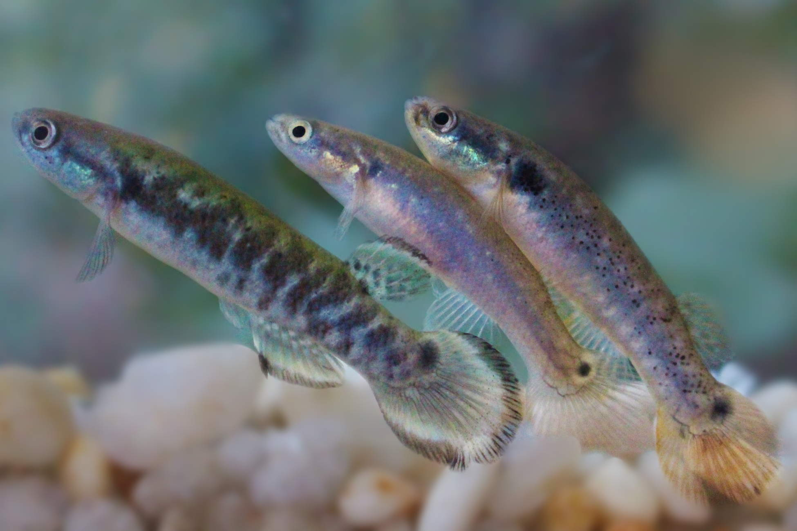

# **Genetic and epigenetic signatures of hybridisation between _Kryptolebias_ species**

This repository contains the scripts (and related files) for genetic and epigenetic analysis used while investigating the hybridisation
between _Kryptolebias ocellatus_ and _Kryptolebias hermaphroditus_ in southeast Brazil.
More detailed information can be found at Berbel-Filho et al. (XXXX).

From left to right, a male of _K. ocellatus_, followed by hermaphrodites of _K. hermaphroditus_ and _K. ocellatus_, respectively.
